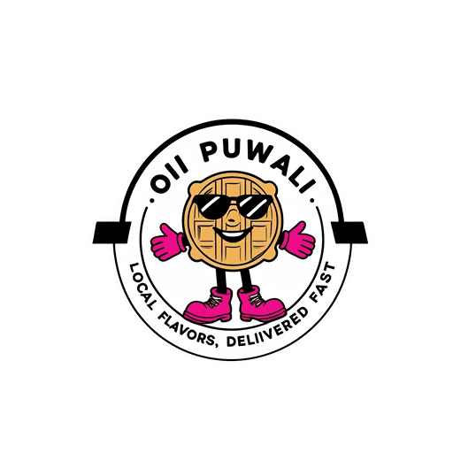

# 🍔 Oii Puwali - Food Delivery App

<p align="center">
  
</p>

<p align="center">
  
  
  
  
</p>

Oii Puwali is a cutting-edge food delivery app that brings delicious meals right to your doorstep. Built with React Native and powered by Supabase, it offers a seamless and delightful food ordering experience.

## ✨ Features

- 🔍 Discover nearby restaurants
- 🍽️ Browse menus and customize orders
- 🛒 Easy cart management
- 💳 Multiple payment options
- 🚚 Real-time order tracking
- 👤 User profiles and order history
- ⭐ Ratings and reviews
- 💖 Favorite restaurants
- 🎨 Sleek and intuitive UI

## 🛠️ Tech Stack

- React Native
- Expo
- Redux Toolkit
- Supabase
- React Navigation
- Expo Location
- Linear Gradient

## 🚀 Getting Started

1. Clone the repo
   ```sh
   git clone https://github.com/sddion/oiipuwali.git
   ```

2. Install NPM packages
   ```sh
   cd oiipuwali
   npm install
   ```

3. Set up your Supabase project and update the configuration in `supabase.js`

4. Start the Expo development server
   ```sh
   npx expo start
   ```

## 📂 Project Structure

```
oiipuwali/
├── assets/
├── components/
├── context/
├── redux/
├── screens/
├── utils/
└── App.js
```

## 🔑 Environment Variables

Create a `.env` file in the root directory and add the following:

```
SUPABASE_URL=your_supabase_project_url
SUPABASE_ANON_KEY=your_supabase_anon_key
GOOGLE_MAPS_API_KEY=your_google_maps_api_key
```

## 🤝 Contributing

Contributions are what make the open-source community such an amazing place to learn, inspire, and create. Any contributions you make are **greatly appreciated**.

## 📄 License

Distributed under the MIT License. See `LICENSE` for more information.

## 📞 Contact

Sddion - [@sddion](https://twitter.com/sddion) - email@example.com

Project Link: [https://github.com/sddion/oiipuwali](https://github.com/sddion/oiipuwali)

## 🙏 Acknowledgments

- [React Native](https://reactnative.dev/)
- [Expo](https://expo.dev/)
- [Supabase](https://supabase.io/)
- [Redux Toolkit](https://redux-toolkit.js.org/)

## 👨‍💻 Author

**sddion**

- GitHub: [@sddion](https://github.com/sddion)
